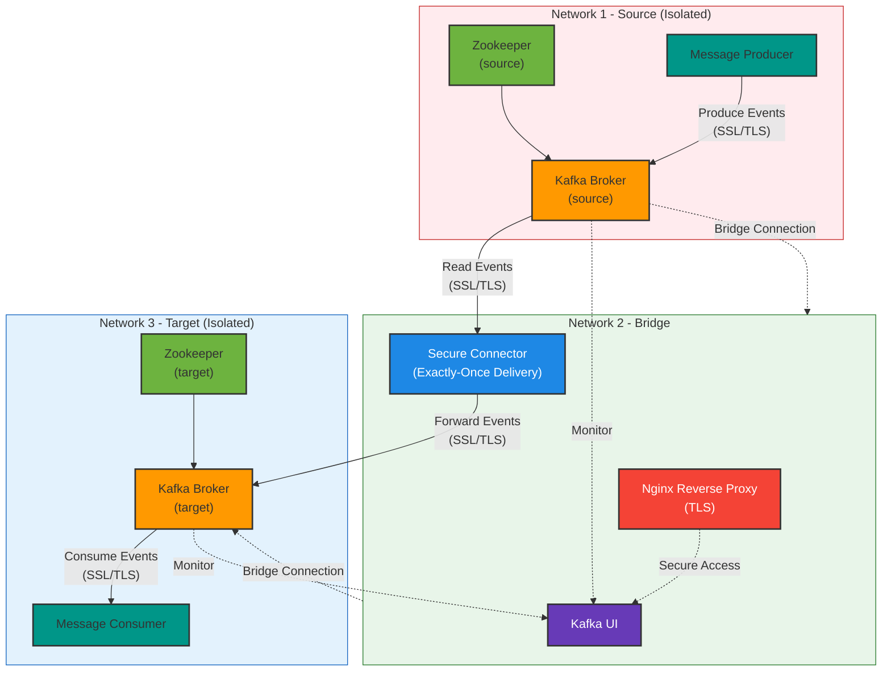
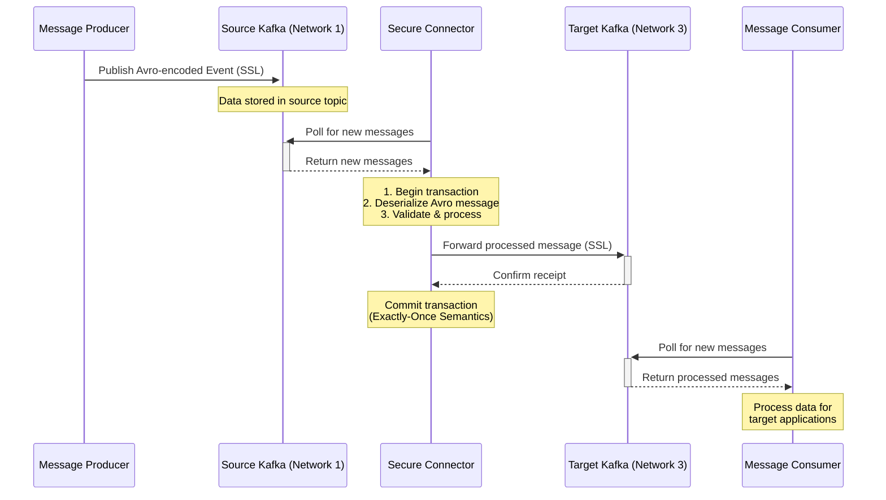

# Secure Kafka Connector POC

A proof of concept (POC) for secure, reliable data streaming between isolated Kafka instances using a custom connector.

## Overview

This POC demonstrates how to securely connect two Kafka clusters across isolated networks using a connector that ensures exactly-once message delivery. It includes:

1. **Source Kafka Instance** (Network 1) - Generates and publishes Avro events.
2. **Target Kafka Instance** (Network 3) - Receives events securely via the connector.
3. **Connector Application** (Network 2) - Connects to both networks and transfers messages with exactly-once semantics.
4. **Kafka UI** (Network 2) - Monitors both Kafka clusters and message transfer.

The system is deployed using Docker Compose with TLS authentication and a reverse proxy for secure access.

## Architecture Diagram



### Flow Diagram



## Security Features

- Isolated Docker networks prevent direct communication between clusters
- TLS authentication for all Kafka connections
- Secure reverse proxy for the Kafka UI
- Exactly-once message delivery semantics

## Prerequisites

- Docker and Docker Compose
- OpenSSL (for certificate generation)

## Quick Start

1. Clone the repository:
   ```bash
   git clone https://github.com/yourusername/secure-kafka-connector-poc.git
   cd secure-kafka-connector-poc
   ```

2. Generate certificates for TLS authentication (included in setup script):
   ```bash
   ./scripts/generate-certs.sh
   ```

3. Start the POC:
   ```bash
   docker-compose up -d
   ```

4. Access the Kafka UI:
   ```
   https://localhost
   ```

5. Run tests to validate message delivery and resilience:
   ```bash
   ./test/docker_network_test.sh
   ```

## Directory Structure

- `backend/` - All backend code
  - `connector/` - Kafka connector application
  - `source-producer/` - Producer for the source Kafka instance
  - `target-consumer/` - Consumer for the target Kafka instance (validation)
  - `avro/` - Avro schema definitions
  - `reverse-proxy/` - Nginx reverse proxy configuration
- `test/` - Test scripts and utilities
- `secrets/` - Generated certificates and keystores
- `.env.local` - Environment configuration (excluded from git)

## Usage

### Sending Messages

Messages can be sent to the source Kafka instance using the included producer:

```bash
docker-compose exec source-producer python producer.py
```

### Monitoring

1. Open the Kafka UI at `https://localhost`
2. Monitor both Kafka clusters and message flow through the connector

### Testing Network Resilience

Run the network test script to verify connector resilience:

```bash
./test/docker_network_test.sh
```

## Changelog

### v0.1.0 (2025-06-11)
- Initial POC implementation
- Basic Docker Compose setup with isolated networks
- TLS authentication for Kafka connections
- Avro serialization/deserialization
- Exactly-once delivery semantics
- Resilience to network outages and Kafka restarts

## License

MIT