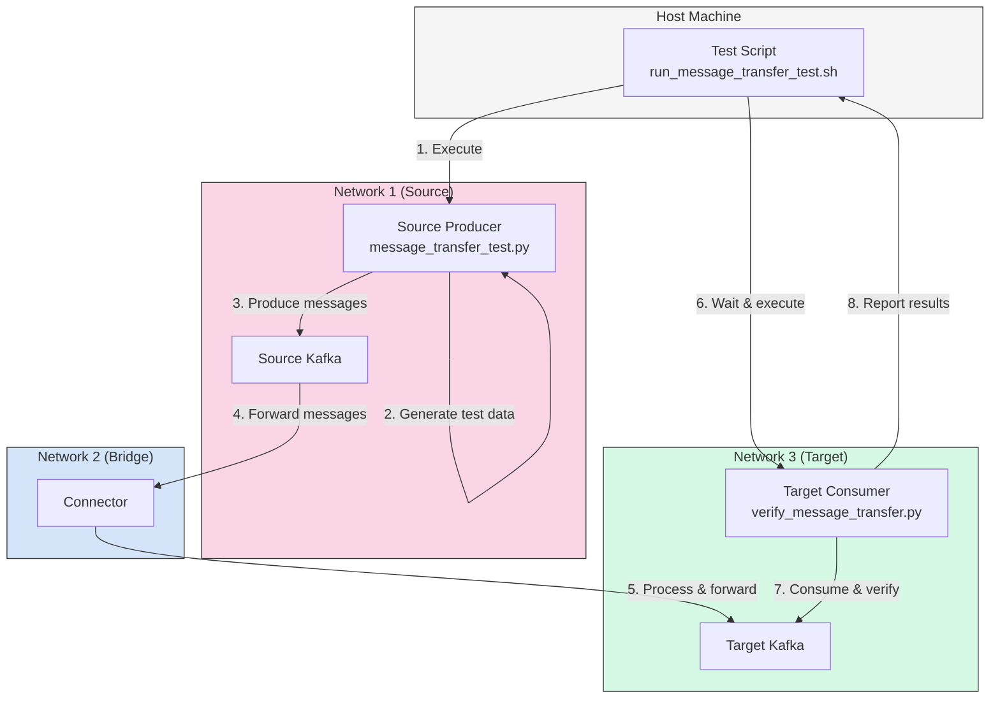
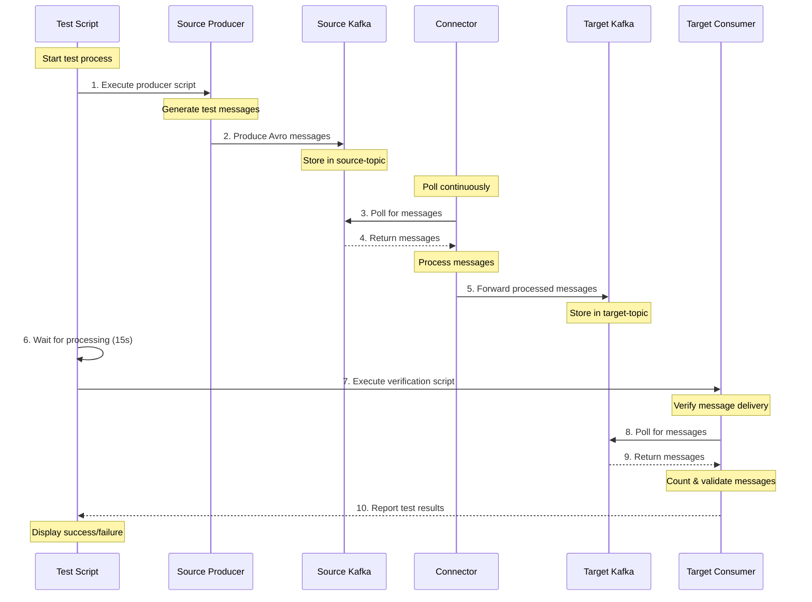

# Automated Testing Documentation for Secure Kafka Connector

This document outlines the automated testing approach for the Secure Kafka Connector application, detailing how tests are initiated, how test data is processed, and how to validate that the application is working as expected.

## Table of Contents
- [Overview](#overview)
- [Test Architecture](#test-architecture)
- [Test Components](#test-components)
- [Testing Process](#testing-process)
- [Test Validation](#test-validation)
- [Test Flow Diagram](#test-flow-diagram)
- [Test Sequence Diagram](#test-sequence-diagram)
- [Running Tests](#running-tests)
- [Troubleshooting](#troubleshooting)

## Overview

The Secure Kafka Connector testing framework is designed to validate the end-to-end message flow through the entire system spanning three isolated networks. The tests ensure:
1. Messages can be successfully produced to the source Kafka cluster
2. The connector properly forwards messages between isolated networks
3. Messages are accurately received by the target Kafka cluster
4. The integrity of the data is maintained throughout the process

## Test Architecture

The testing architecture follows the same network isolation principles as the main application:

1. **Test Producer (network1)** - Generates test messages for the source Kafka cluster
2. **Test Consumer (network3)** - Consumes and verifies messages from the target Kafka cluster
3. **Test Orchestration** - Shell scripts run from the host machine coordinate the tests

This allows testing of the complete data flow path across all isolated networks.

## Test Components

### 1. Test Orchestration Scripts
- **run_message_transfer_test.sh** - Main orchestration script for end-to-end testing
- **docker_network_test.sh** - Tests Docker network isolation and connectivity

### 2. Test Data Generation
- **message_transfer_test.py** - Produces test messages to the source Kafka cluster
- **Avro Schema Definition** - Located at `backend/avro/schema.avsc`, defines the test message format

### 3. Test Validation
- **verify_message_transfer.py** - Consumes and validates messages from the target Kafka cluster

### 4. Test Container Environment
- **Dockerfile.test** - Defines the test container environment with necessary dependencies

## Testing Process

### Test Initiation

The testing process is initiated through the `run_message_transfer_test.sh` script, which:

1. Validates that the Docker environment is running properly
2. Ensures the Avro schema exists (creates it if missing)
3. Makes test scripts executable
4. Sets up the number of test messages to send (default: 100)

```bash
# Execute the test script with optional message count
./test/run_message_transfer_test.sh [NUMBER_OF_MESSAGES]
```

### Test Data Generation

The test data generation occurs in the `message_transfer_test.py` script:

1. It loads the Avro schema from one of several possible locations
2. Configures a Kafka producer to connect to the source Kafka broker
3. Generates the specified number of test messages (default: 100)
4. Each message contains:
   - A unique event ID
   - A timestamp
   - A test run ID (UUID)
   - Message content with test metadata
5. Messages are serialized using Avro format
6. Messages are produced to the source Kafka topic

```python
def create_test_message(msg_id):
    """Create a test message with a unique ID"""
    timestamp = int(time.time() * 1000)
    return {
        'eventId': str(msg_id),
        'eventType': 'TEST_MESSAGE',
        'timestamp': timestamp,
        'payload': {
            'messageNumber': msg_id,
            'testRunId': str(uuid.uuid4()),
            'content': f'Test message {msg_id} of {NUM_MESSAGES}'
        }
    }
```

### Message Processing

Once messages are sent to the source Kafka topic, the following process occurs:

1. The connector component picks up messages from the source Kafka topic
2. Messages are processed through the connector:
   - Deserialized from Avro format
   - Potentially transformed (depending on configuration)
   - Re-serialized to Avro format
3. Messages are forwarded to the target Kafka topic

### Test Data Validation

The validation process is handled by the `verify_message_transfer.py` script:

1. It configures a Kafka consumer to connect to the target Kafka broker
2. Listens on the target topic for the specified timeout period (default: 60 seconds)
3. Consumes messages and deserializes them using the Avro schema
4. Tracks unique messages by their event ID to prevent double-counting
5. Reports success if all expected messages are received
6. Reports warning if fewer than expected messages are received
7. Provides detailed statistics on the number of messages processed

## Test Validation

The testing system validates:

1. **Message Integrity**: All fields and values match expected patterns
2. **Message Completeness**: All messages sent from the source are received at the target
3. **Processing Time**: The system can process the specified number of messages within the timeout period

A successful test displays output similar to:

```
Message Transfer Test Results
============================
Expected messages: 100
Received messages: 100
SUCCESS: All expected messages received!
```

## Test Flow Diagram



## Test Sequence Diagram



## Running Tests

To execute the automated tests:

1. Ensure the Docker environment is running:
   ```bash
   docker compose up -d
   ```

2. Run the test script with optional message count parameter:
   ```bash
   ./test/run_message_transfer_test.sh 100
   ```

3. Monitor the output for test progress and results.

4. Verify the final success/failure message at the end of the test.

## Additional Test Types

### Docker Network Isolation Testing

The system also includes tests for validating network isolation using the `docker_network_test.sh` script:

1. Tests that containers in network1 can only communicate with other containers in network1 or shared networks
2. Tests that containers in network3 can only communicate with other containers in network3 or shared networks
3. Verifies that direct communication between network1 and network3 is not possible

### Direct Message Testing

The `direct_message_test.py` script provides additional functionality for:

1. Testing direct message flow between specific Kafka topics without using the connector
2. Testing specific message formats and patterns
3. Performance testing with high message volumes

## Troubleshooting

Common testing issues and solutions:

1. **Missing Avro Schema**
   - The test script creates a default schema if missing, but custom schemas must be placed in `backend/avro/schema.avsc`

2. **Connection Failures**
   - Ensure all containers are running: `docker compose ps`
   - Check network configuration: `docker network ls`

3. **Message Timeout**
   - Adjust the timeout period in `verify_message_transfer.py` for larger message volumes
   - Default timeout is 60 seconds

4. **Validation Failures**
   - Check connector logs: `docker compose logs connector`
   - Ensure schema consistency between producer and consumer

## Conclusion

The automated testing approach for the Secure Kafka Connector ensures that messages flow correctly through the system while maintaining network isolation. The tests validate both functional aspects (message delivery and integrity) and security aspects (network isolation) of the system.

For advanced testing scenarios or custom test configurations, the existing scripts can be modified or extended to suit specific requirements.
