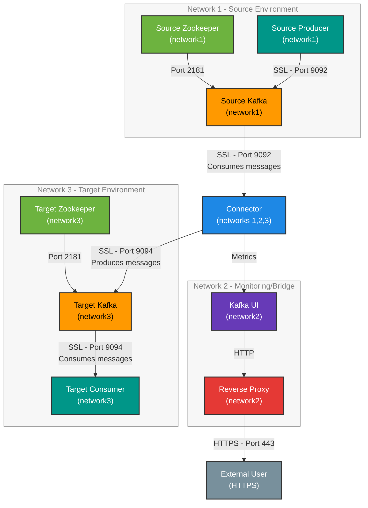
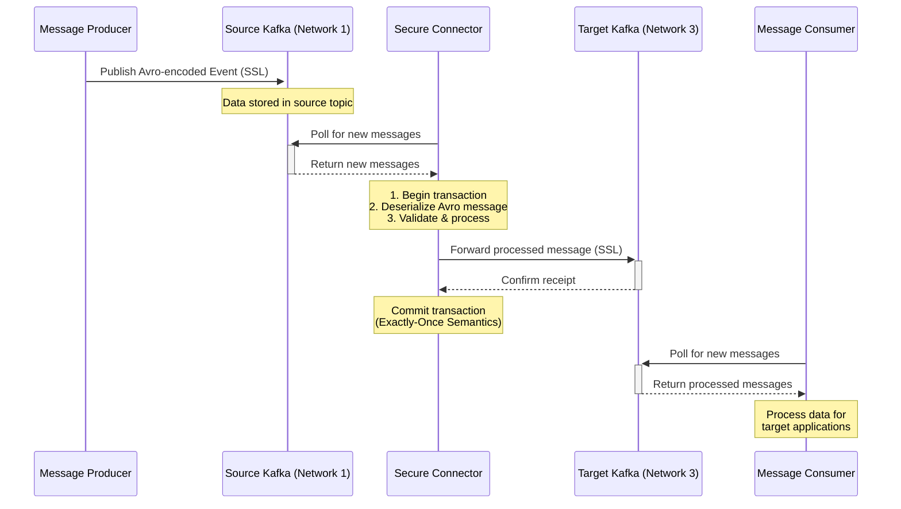

# Secure Kafka Connector Architecture

This document provides a detailed overview of the architecture for the Secure Kafka Connector POC, focusing on network isolation and data flow.

## Network Architecture Diagram

## Component Details

### Network 1 (Source Environment)

* **Source Zookeeper**: Manages the source Kafka cluster configuration
* **Source Kafka**: Broker that receives messages from producers
* **Source Producer**: Generates test messages with Avro serialization

### Network 2 (Monitoring/Bridge Environment)

* **Kafka UI**: Monitoring interface for both Kafka clusters
* **Reverse Proxy**: Provides secure HTTPS access to the Kafka UI

### Network 3 (Target Environment)

* **Target Zookeeper**: Manages the target Kafka cluster configuration
* **Target Kafka**: Broker that receives messages from the connector
* **Target Consumer**: Receives and processes messages from target Kafka

### Cross-Network Component

* **Connector**: The only component with access to all three networks
  * Reads messages from Source Kafka (Network 1)
  * Provides metrics to Kafka UI (Network 2)
  * Writes messages to Target Kafka (Network 3)
  * Implements exactly-once semantics with transactional delivery
  * Acts as the sole bridge between the three isolated networks

## Security Features

1. **Network Isolation**: Each environment is isolated in its own Docker network
2. **SSL/TLS Encryption**: All Kafka communication is encrypted
3. **Client Authentication**: SSL certificates required for client authentication
4. **HTTPS Proxy**: Web UI access is secured via HTTPS
5. **Exactly-Once Semantics**: Transaction IDs and offsets ensure no message loss or duplication

## Data Flow

This architecture ensures secure, reliable message delivery between isolated Kafka environments with centralized monitoring capabilities.
