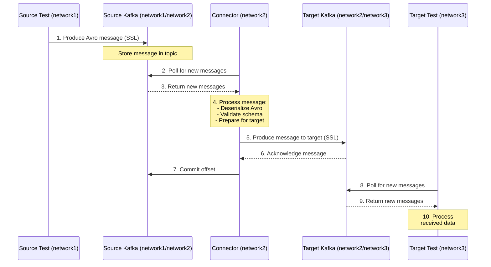
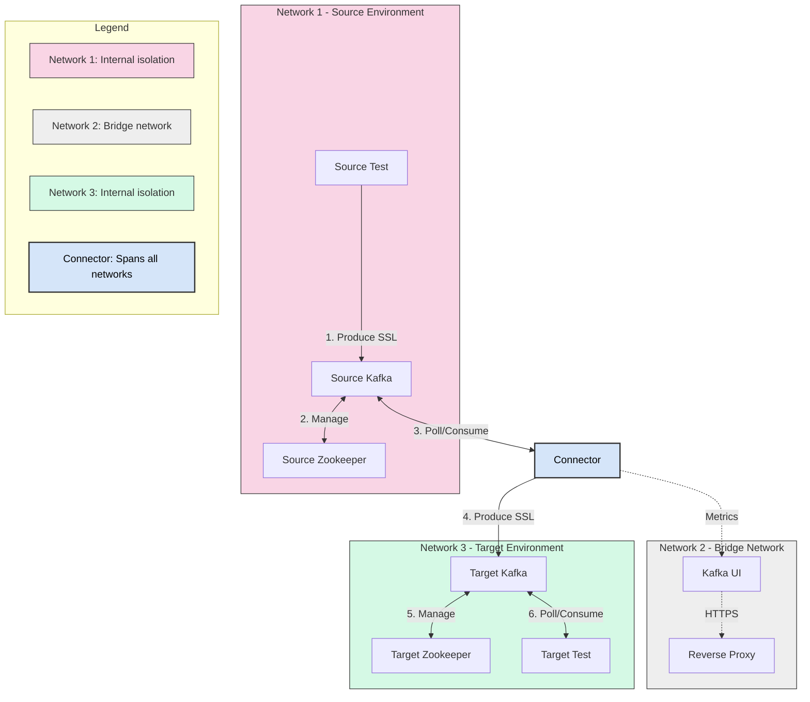

# Secure Kafka Connector Documentation

This document provides detailed technical documentation of the Secure Kafka Connector implementation, with particular focus on network isolation and bridging mechanisms.

## Table of Contents
- [System Overview](#system-overview)
- [Network Architecture](#network-architecture)
  - [Network Isolation Strategy](#network-isolation-strategy)
  - [Network Bridge Implementation](#network-bridge-implementation)
- [Component Details](#component-details)
- [Data Flow](#data-flow)
- [Security Implementation](#security-implementation)
- [Sequence Diagram](#sequence-diagram)
- [Flow Diagram](#flow-diagram)

## System Overview

The Secure Kafka Connector is designed to securely transfer messages between isolated Kafka environments (source and target) with network isolation as a primary security control. The system consists of three isolated Docker networks with a specialized connector component that bridges these networks to enable controlled data flow.

## Network Architecture

### Network Isolation Strategy

The system implements a multi-network architecture with three distinct Docker networks:

1. **Network 1 (Source Environment)** - `network1`
   - Configured as an internal bridge network (`internal: true`)
   - Contains the source Kafka broker, Zookeeper, and test producer
   - Isolated from external connections
   - Components can only communicate within the network or via explicitly bridged components

2. **Network 2 (Monitoring/Bridge Network)** - `network2`
   - Configured as a standard bridge network
   - Contains the monitoring UI and reverse proxy
   - Acts as the intermediate network between source and target environments
   - Only limited components from other networks connect to this network

3. **Network 3 (Target Environment)** - `network3`
   - Configured as an internal bridge network (`internal: true`)
   - Contains the target Kafka broker, Zookeeper, and test consumer
   - Isolated from external connections
   - Components can only communicate within the network or via explicitly bridged components

### Network Bridge Implementation

The network bridge is primarily implemented through the **Connector** component, which is the only component with access to all three networks. This isolation pattern is implemented in the Docker Compose configuration:

```yaml
# Source Kafka - Connected only to network1
source-kafka:
  # configuration...
  networks:
    - network1

# Target Kafka - Connected only to network3
target-kafka:
  # configuration...
  networks:
    - network3

# Connector - Connected to all three networks to act as a bridge
connector:
  # configuration...
  environment:
    - SOURCE_BOOTSTRAP_SERVER=source-kafka:9092
    - TARGET_BOOTSTRAP_SERVER=target-kafka:9094
  networks:
    - network1
    - network2
    - network3

# Network definitions
networks:
  network1:
    driver: bridge
    internal: true  # No external access
  network2:
    driver: bridge  # Can have external access
  network3:
    driver: bridge
    internal: true  # No external access
```

This configuration creates a controlled bridge where:

1. Network1, network2, and network3 are completely independent of each other
2. The connector is explicitly connected to all three networks
3. Direct communication between network1 and network3 is impossible
4. Network2 contains monitoring components but cannot directly access Kafka brokers
5. The connector becomes the only path for data to flow between all networks

## Component Details

### Source Environment (network1)
- **source-zookeeper**: Manages the source Kafka cluster configuration
- **source-kafka**: Broker that receives messages from producers
  - Connected only to network1
  - SSL/TLS configured for secure communications
- **source-test**: Generates test messages with Avro serialization

### Bridge/Monitoring Environment (network2)
- **kafka-ui**: Confluent Control Center for monitoring Kafka clusters
- **reverse-proxy**: NGINX proxy providing secure access to the UI

### Target Environment (network3)
- **target-zookeeper**: Manages the target Kafka cluster configuration
- **target-kafka**: Broker that receives messages from the connector
  - Connected only to network3
  - SSL/TLS configured for secure communications
- **target-test**: Consumes and processes messages from target Kafka

### Cross-Network Component
- **connector**: The critical bridging component that connects all networks
  - Connected to all three networks (network1, network2, and network3)
  - Reads directly from source-kafka:9092 in network1
  - Communicates monitoring data to kafka-ui in network2
  - Writes directly to target-kafka:9094 in network3

## Network Bridge Technical Implementation

The connector component implements the network bridge functionality through the following mechanisms:

1. **Multi-Network Access**:
   - The connector component has direct access to all three networks
   - It explicitly connects to network1, network2, and network3
   - It communicates directly with source-kafka in network1
   - It communicates directly with target-kafka in network3

2. **Connector Implementation**:
   ```python
   class KafkaConnector:
       def __init__(self):
           # Configuration
           self.source_topic = os.environ.get('SOURCE_TOPIC', 'source-topic')
           self.target_topic = os.environ.get('TARGET_TOPIC', 'target-topic')
           self.source_bootstrap_server = os.environ.get('SOURCE_BOOTSTRAP_SERVER', 'source-kafka:9092')
           self.target_bootstrap_server = os.environ.get('TARGET_BOOTSTRAP_SERVER', 'target-kafka:9094')
   ```

3. **Connection Management**:
   - Establishes separate connections to both Kafka brokers:
   ```python
   def setup_consumer(self):
       # Connect to source-kafka:9092 (network1/network2)
       consumer_conf = {
           'bootstrap.servers': self.source_bootstrap_server,
           # Other configuration...
       }
       self.consumer = Consumer(consumer_conf)
       
   def setup_producer(self):
       # Connect to target-kafka:9094 (network2/network3)
       producer_conf = {
           'bootstrap.servers': self.target_bootstrap_server,
           # Other configuration...
       }
       self.producer = Producer(producer_conf)
   ```

4. **Message Transfer Process**:
   ```python
   def process_messages(self):
       # Subscribe to source topic in network1
       self.consumer.subscribe([self.source_topic])
       
       while True:
           # Poll messages from source-kafka (network1)
           msg = self.consumer.poll(1.0)
           
           # Process message
           event = self.avro_deserialize(msg.value())
           
           # Send to target-kafka (network3)
           self.producer.produce(
               self.target_topic, 
               value=avro_data, 
               callback=lambda err, msg: self.delivery_callback(err, msg)
           )
   ```

## Security Implementation

1. **Network Isolation**:
   - Docker's `internal: true` flag prevents networks from external access
   - Communication between isolated networks can only occur through explicitly defined bridges

2. **SSL/TLS Encryption**:
   - All Kafka communication is encrypted using SSL/TLS
   - Implementation in connector:
   ```python
   # Add SSL/TLS config for consumer (source network)
   consumer_conf.update({
       'security.protocol': 'SSL',
       'ssl.ca.location': '/etc/kafka/secrets/source-ca.pem',
       'ssl.certificate.location': '/etc/kafka/secrets/source-client.pem',
       'ssl.key.location': '/etc/kafka/secrets/source-client.key',
       'ssl.key.password': 'keypass'
   })
   
   # Add SSL/TLS config for producer (target network)
   producer_conf.update({
       'security.protocol': 'SSL',
       'ssl.ca.location': '/etc/kafka/secrets/target-ca.pem',
       'ssl.certificate.location': '/etc/kafka/secrets/target-client.pem',
       'ssl.key.location': '/etc/kafka/secrets/target-client.key',
       'ssl.key.password': 'keypass'
   })
   ```

3. **Secure Message Handling**:
   - Manual offset commit ensures no message loss
   - Avro serialization provides schema validation

4. **HTTPS Access**:
   - Reverse proxy configured to provide HTTPS access to UI components

## Sequence Diagram

The following sequence diagram illustrates the data flow through the network bridge:



## Flow Diagram

This flow diagram illustrates the overall network topology and data flow paths:



## Detailed Network Bridge Analysis

The network bridge implementation relies on several key design patterns:

1. **Segmented Network Design**
   - Each functional area is isolated in its own network
   - External access is disabled for network1 and network3 using `internal: true`

2. **Direct Network Access Pattern**
   - Each network is fully isolated from the others
   - Kafka brokers are contained entirely within their respective networks
   - source-kafka exists only in network1
   - target-kafka exists only in network3

3. **Bridge Node Pattern**
   - The connector acts as a controlled bridge between isolated networks
   - It exists simultaneously in all three networks (network1, network2, and network3)
   - It's the only component with access to multiple networks

4. **Security-by-Design**
   - SSL/TLS encryption on all Kafka connections
   - Network isolation as a primary security control
   - Controlled data flow through a single, audited bridge component

This architecture ensures that network traffic is strictly controlled and follows predetermined paths, enhancing security while maintaining necessary connectivity between isolated environments.
